<div align="center">

# ❖ V E R I T A S ❖
### *Autonomous Multimodal Intelligence & Truth Verification Engine*

<br/>

[](https://nextjs.org/)
[](https://fastapi.tiangolo.com/)
[](https://python.org)
[](https://langchain-ai.github.io/langgraph/)
[](https://tailwindcss.com/)
[](https://www.postgresql.org/)
[](https://www.docker.com/)
[](LICENSE)

<br/>

```
       ▲  ┌────────────────────────────────────────────────────────┐  ▲
      /█\ │   V E R I T A S   I N T E L L I G E N C E   N E T W O R K   │ /█\
     /███\│   Autonomous Multi-Agent Fact-Checking & Deep Synthesis│/███\
    /█████\────────────────────────────────────────────────────────/█████\
   ┌──────────────────────────────────────────────────────────────────────┐
   │  [ TEXT ]      [ IMAGE ]      [ AUDIO ]      [ VIDEO ]    [ SYNTH ]  │
   │  NLP Screen    OCR & Forensics Spectral Wave  Frame Audit  Consensus │
   └──────────────────────────────────────────────────────────────────────┘
```

<p align="center">
  <b>Veritas</b> is an enterprise-grade, state-of-the-art forensic truth-checking ecosystem that unites high-performance NLP sentence decomposition, multi-engine live web research fanout, Google Fact Check graph indexing, and LangGraph agentic reasoning.
</p>

---

</div>

<br/>

## 🌐 Isometric Architectural Topology

```mermaid
graph TB
    subgraph "🎨 Editorial Client Layer (Next.js 15 App Router)"
        UI["🖥️ Veritas Studio UI<br/>(Desk Masthead · Galley Proof · Exhibit Ledger)"]
        AUTH_FE["🔐 Client Auth & Session<br/>(JWT Bearer · Argon2id Token)"]
        DESK_FE["🎛️ Multimodal Desks<br/>(Text · Image · Audio · Video · Decision)"]
    end

    subgraph "⚡ API Gateway & Core Pipeline (FastAPI)"
        GATEWAY["🛡️ FastAPI Route Controller<br/>(/api/v1/verify · /extract-claim · /research)"]
        EXTRACTOR["📜 NLP Claim Extraction Engine<br/>(spaCy en_core_web_sm · NLTK Punkt · TF-IDF)"]
        FANOUT["🔍 Multi-Provider Live Search Fanout<br/>(Tavily · Brave · Serper)"]
        FACTCHECK_INDEX["🔎 Google FactCheck Claims Graph<br/>(Publisher Review Index · Stance Matcher)"]
    end

    subgraph "🧠 Multi-Agent Orchestration (LangGraph)"
        CLAIM_AGENT["🤖 Claim Dissector Agent"]
        SEARCH_AGENT["🌐 Evidence Retrieval Agent"]
        CONTRADICTION_AGENT["⚖️ Cross-Source Contradiction Agent"]
        JUDGE_AGENT["🏛️ Supreme Verdict & Confidence Agent"]
    end

    subgraph "🗄️ Persistence & Intelligence Vaults"
        PG[("🐘 PostgreSQL 16<br/>(Verifications · Claims · Accounts)")]
        CHROMA[("🔮 Chroma / Vector DB<br/>(Semantic Evidence Embeddings)")]
    end

    UI --> GATEWAY
    AUTH_FE --> GATEWAY
    DESK_FE --> GATEWAY

    GATEWAY --> EXTRACTOR
    GATEWAY --> FANOUT
    GATEWAY --> FACTCHECK_INDEX

    EXTRACTOR --> CLAIM_AGENT
    FANOUT --> SEARCH_AGENT
    FACTCHECK_INDEX --> CONTRADICTION_AGENT

    CLAIM_AGENT --> SEARCH_AGENT --> CONTRADICTION_AGENT --> JUDGE_AGENT
    JUDGE_AGENT --> PG
    SEARCH_AGENT --> CHROMA
```



<br/>

---

## ✨ 3D Feature Matrix & Multimodal Desks

<table>
  <thead>
    <tr>
      <th width="80">Icon</th>
      <th width="200">Intelligence Desk</th>
      <th width="300">Forensic Capabilities</th>
      <th width="220">Underlying Engine</th>
    </tr>
  </thead>
  <tbody>
    <tr>
      <td align="center">📝</td>
      <td><b>Text Forensics</b></td>
      <td>Clause-by-clause claim isolation, named entity recognition (NER), and opinion vs. fact classification.</td>
      <td><code>spaCy</code> · <code>NLTK</code> · <code>scikit-learn</code></td>
    </tr>
    <tr>
      <td align="center">🔍</td>
      <td><b>Live Web Fanout</b></td>
      <td>Concurrent querying across search providers, two-stage URL & story deduplication, verbatim snippet quote matching.</td>
      <td><code>Tavily</code> · <code>Brave Search</code> · <code>Serper</code></td>
    </tr>
    <tr>
      <td align="center">⚖️</td>
      <td><b>Fact-Check Index</b></td>
      <td>Direct integration with Google Fact Check API, stance mapping, and publisher agreement verification.</td>
      <td><code>Google FactCheck API</code></td>
    </tr>
    <tr>
      <td align="center">🎙️</td>
      <td><b>Speech & Audio Desk</b></td>
      <td>Spectral speech boundary bracketing, audio transcription alignment, and audio tamper detection.</td>
      <td><code>Whisper</code> · <code>Librosa</code></td>
    </tr>
    <tr>
      <td align="center">🖼️</td>
      <td><b>Vision & Image Desk</b></td>
      <td>OCR optical character extraction, visual anomaly detection, and reverse image relevance mapping.</td>
      <td><code>Tesseract OCR</code> · <code>Pillow</code> · <code>CV2</code></td>
    </tr>
    <tr>
      <td align="center">🏛️</td>
      <td><b>Supreme Decision Desk</b></td>
      <td>Consolidated evidence synthesis, cross-verification verdict signing, and confidence calculation.</td>
      <td><code>LangGraph</code> · <code>OpenAI / Ollama</code></td>
    </tr>
  </tbody>
</table>

<br/>

---

## 🛠️ Technology Stack Breakdown

<div align="center">

| Domain | Technologies |
| :--- | :--- |
| **Frontend Framework** | `Next.js 15 (App Router)`, `React 19`, `TypeScript` |
| **Styling & Aesthetics** | `Tailwind CSS 4`, Custom Editorial Design System, Monospace Slips |
| **Backend Core** | `Python 3.12+`, `FastAPI`, `Uvicorn`, `Pydantic v2` |
| **Agentic Workflow** | `LangGraph`, `LangChain Core`, `Ollama / OpenAI API` |
| **NLP & Extraction** | `spaCy (en_core_web_sm)`, `NLTK (punkt_tab, stopwords)`, `scikit-learn` |
| **Search & Fact Checking** | `Tavily API`, `Brave Search API`, `Serper Dev API`, `Google Fact Check Tools` |
| **Storage & Caching** | `PostgreSQL 16`, `SQLAlchemy 2.0 (Async)`, `Alembic`, `ChromaDB` |
| **Security & Auth** | `Argon2id (argon2-cffi)`, `JWT (PyJWT)`, `NIST SP 800-63B Compliant` |
| **Container & CI/CD** | `Docker`, `Docker Compose`, `Pytest`, `Ruff`, `MyPy` |

</div>

<br/>

---

## 📁 Repository Monorepo Structure

```text
veritas/
├── 🌐 frontend/                      # Next.js 15 Client Application
│   ├── src/
│   │   ├── app/                     # App Router (Archive, Desks, Legal, Intel)
│   │   │   ├── intel/               # Specialized Desks (Text, Audio, Video, Image)
│   │   │   ├── archive/             # Forensic Record Archives & Files
│   │   │   └── layout.tsx           # Editorial Master Layout
│   │   ├── components/              # Design System (ExhibitLedger, Slips, Badges)
│   │   │   ├── agents/              # Instrument Benches & Forensics Slates
│   │   │   └── ui/                  # Drawers, Verification Badges, Notices
│   │   ├── context/                 # AuthContext & Session Management
│   │   └── lib/api/                 # Axios / Fetch API client & Stamp Generators
│   └── package.json
│
├── ⚡ backend/                       # High-Throughput FastAPI Intelligence Service
│   ├── app/
│   │   ├── api/v1/routes/           # Endpoints: /verify, /extract-claim, /research
│   │   ├── core/                    # Settings, Config, Error Handlers, Logging
│   │   ├── database/                # Async Engine, Base, Sessions
│   │   ├── desks/                   # Multimodal Desk Handlers & State Machines
│   │   ├── graph/                   # LangGraph Multi-Agent Workflows & Scoring
│   │   ├── models/                  # SQLAlchemy ORM Schema Models
│   │   ├── nlp/                     # spaCy / NLTK Sentence & Claim Partitioning
│   │   ├── repositories/            # SQL / Memory Data Access Layer
│   │   ├── research/                # Query Builders, Multi-Engine Fanout & Deduplication
│   │   ├── schemas/                 # Pydantic Input/Output Validation Contracts
│   │   ├── search/                  # Brave, Tavily, Serper Search Integrations
│   │   ├── security/                # Argon2id Hashing, JWT Minting & Verifiers
│   │   ├── services/                # Verification, Claims, and Research Services
│   │   └── vectorstore/             # Chroma & In-Memory Vector Storage
│   ├── alembic/                     # Database Schema Migrations
│   ├── tests/                       # Complete Pytest Suite & Offline Benches
│   ├── Dockerfile                   # Production Multi-Stage Container
│   ├── docker-compose.yml           # Complete Stack Compose
│   └── pyproject.toml
│
└── 🧠 claude-skills/                 # AI Engineering, Research & Workflow Standards
```

<br/>

---

## 🚀 Quickstart & Installation

### Option 1: Instant Start with Docker Compose (Recommended)

```bash
# 1. Clone the repository
git clone https://github.com/eunemi/VERITAS.git
cd VERITAS

# 2. Configure environment keys
cp backend/.env.example backend/.env

# 3. Launch both Frontend and Backend
docker compose -f backend/docker-compose.yml up --build
```
* **Frontend**: `http://localhost:3000`
* **FastAPI Docs**: `http://localhost:8000/docs`
* **Health Check**: `http://localhost:8000/health`

<br/>

### Option 2: Local Host Development Setup

#### 1. Backend Setup
```bash
cd backend

# Create and activate virtual environment
python3 -m venv .venv
source .venv/bin/activate

# Install dependencies
pip install -r requirements-dev.txt

# Download required NLP Models
python -m spacy download en_core_web_sm
python -m nltk.downloader punkt_tab stopwords

# Setup configuration
cp .env.example .env

# Run database migrations & start development server
alembic upgrade head
uvicorn app.main:app --reload --port 8000
```

#### 2. Frontend Setup
```bash
cd frontend

# Install node dependencies
npm install

# Start Next.js development server
npm run dev
```

<br/>

---

## 🔌 API Endpoints Showcase

```bash
# Claim Extraction
POST /api/v1/extract-claim
Content-Type: application/json
{
  "text": "The Queensferry Crossing opened in 2017 and cost £1.35bn. It is magnificent."
}
```

```json
{
  "claims": [
    {
      "ref": 1,
      "text": "The Queensferry Crossing opened in 2017.",
      "quote": "The Queensferry Crossing opened in 2017",
      "start": 0,
      "end": 39,
      "checkable": true,
      "entities": [{"text": "Queensferry Crossing", "label": "FAC"}, {"text": "2017", "label": "DATE"}],
      "keywords": [{"term": "queensferry crossing", "score": 1.0}]
    },
    {
      "ref": 2,
      "text": "The Queensferry Crossing cost £1.35bn.",
      "quote": "cost £1.35bn",
      "start": 44,
      "end": 56,
      "checkable": true,
      "entities": [{"text": "£1.35bn", "label": "MONEY"}]
    },
    {
      "ref": 3,
      "text": "It is magnificent.",
      "checkable": false,
      "reason": "opinion"
    }
  ],
  "count": 3,
  "checkable_count": 2
}
```

<br/>

---

## 🧪 Testing & Code Quality

Run tests offline with zero network dependencies:

```bash
# Run complete Pytest suite
pytest backend/tests

# Run standalone offline test runner
python3 backend/offline_search_tests.py

# Lint & Typecheck
ruff check backend/ && ruff format --check backend/ && mypy backend/app
```

<br/>

---

## 🔒 Security & Standards

* **Password Hashing**: OWASP-recommended **Argon2id** (`argon2-cffi`) with secure salt and memory parameters.
* **Token Verification**: Hardened HS256 JWT tokens requiring strict standard claims (`sub`, `type`, `exp`, `iat`, `jti`).
* **Input Validation**: Strict RFC-compliant Pydantic models with input truncation bounds to prevent ReDoS & payload abuse.

---

## Production deployment

Deploy the frontend from `frontend/` to Vercel and the API from `backend/` to a
Render Web Service. The API's durable PostgreSQL store belongs on Neon; no second
backend service is needed. The Docker image honours Render's `PORT` and exposes
`/health` for the service health check.

Set `NEXT_PUBLIC_API_URL` in Vercel for every environment (Development, Preview,
and Production) to the public Render URL plus `/api/v1`, for example
`https://api.example.com/api/v1`. It is a public, build-time value; never put a
credential in a `NEXT_PUBLIC_*` variable. Copy
`frontend/.env.example` for local development.

On Render, set these server-only variables: `ENVIRONMENT=production`, a unique
`JWT_SECRET_KEY`, `DATABASE_URL`, and `CORS_ORIGINS` containing the exact Vercel
origins. Use Neon's **pooled** connection string with the `postgresql+asyncpg://`
driver for `DATABASE_URL`; use a separate direct URL only when running Alembic
migrations. Configure optional provider keys only for providers you enable:
`OPENAI_API_KEY`, `TAVILY_API_KEY`, `BRAVE_API_KEY`, `SERPER_API_KEY`, and
`GOOGLE_FACT_CHECK_API_KEY`. Start from `backend/.env.example`; do not upload an
`.env` file or commit a real secret.

Before promoting a release, run migrations once against the target database:

```bash
cd backend
DATABASE_URL='postgresql+asyncpg://…' alembic upgrade head
```

This initial migration creates tables and indexes; it does not delete data. Take a
Neon restore point before every future schema migration. The service's `/health` is
liveness only, so a dependency outage does not cause restart loops.

For validation, run `npm ci && npm run lint && npm run build` in `frontend/`, then
`pip install -r requirements-dev.txt`, `ruff check app`, `mypy app`, and `pytest` in
`backend/`. Render should also enforce a request-body limit at its edge: the app
rejects oversized declared bodies, while chunked requests require the proxy limit.

---

<div align="center">
  <sub>Built with precision and verifiable truth. © 2026 Veritas Intelligence.</sub>
</div>
